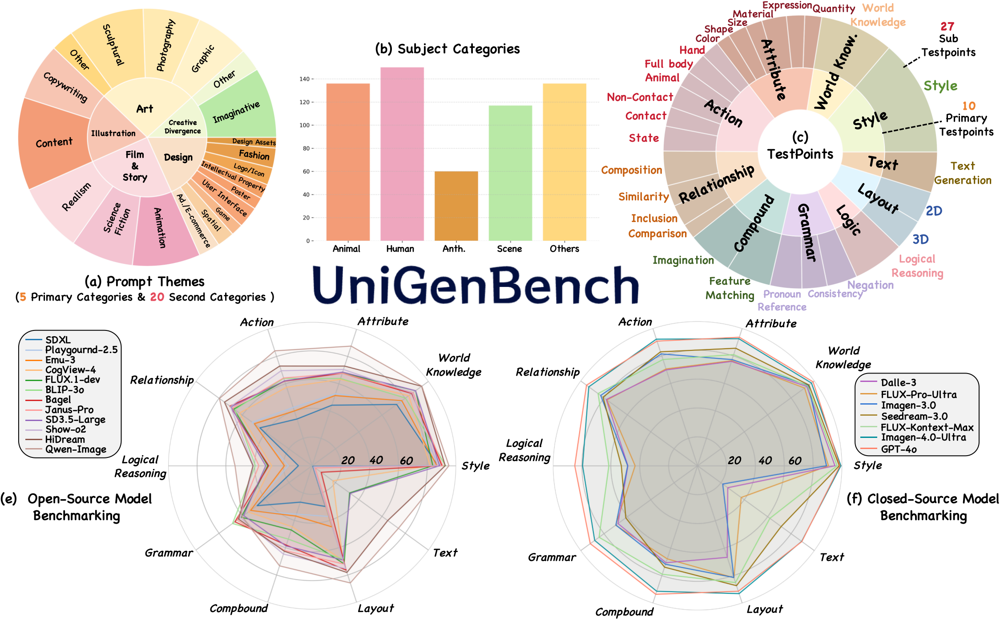
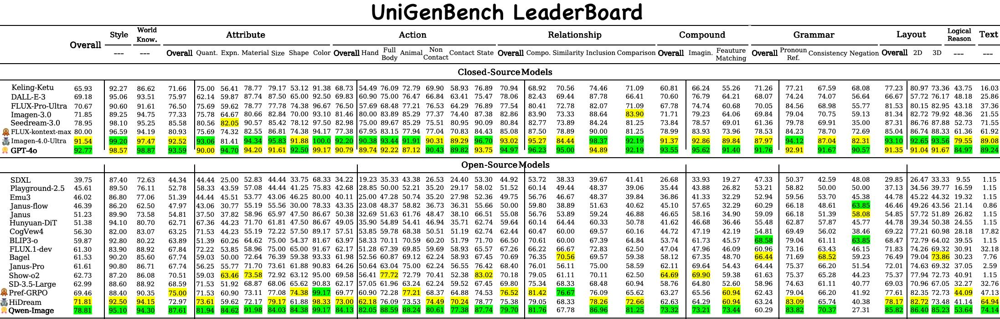

<div align="center">
    <h1 align="center"> UniGenBench: Unified Text-to-Image Generation Benchmark
    </h1>


Hunyuan, Tencent & [UnifiedReward](https://github.com/CodeGoat24/UnifiedReward) Team

<a href="">
</a>

<a href="https://codegoat24.github.io/UnifiedReward/Pref-GRPO">
</a>

[](https://huggingface.co/CodeGoat24/FLUX.1-dev-PrefGRPO) [](https://huggingface.co/spaces/CodeGoat24/UniGenBench_Leaderboard)


</div>

## Introduction

We propose <b>UniGenBench</b>, a unified and versatile benchmark for image generation that integrates diverse prompt themes with a comprehensive suite of fine-grained evaluation criteria. 



### ✨ Highlights:

- **Comprehensive and fine-grained evaluation**: covering 10 **primary** dimensions and 27 **sub-dimensions**, enabling systematic and fine-grained assessment of diverse model capabilities.

- **Rich prompt theme coverage**: organized into 5 **primary** themes and 20 **sub-themes**, comprehensively spanning both realistic and imaginative generation scenarios.

- **Efficient yet comprehensive**: unlike other benchmarks, UniGenBench requires only **600 prompts**, with each prompt targeting **1–5 specific testpoint**, ensuring both coverage and efficiency.

- **Reliable MLLM Evaluation**: Each testpoint of the prompt is accompanied by a **detailed description**, explaining how the testpoint is reflected in the prompt, assisting MLLM in conducting precise evaluations.

- **Bilingual support**: providing test prompts in both **English** and **Chinese**, together with evaluation pipelines for both languages, thus enabling fair and broad cross-lingual benchmarking.




## 📑 Prompt Introduction
Each prompt in our benchmark is recorded as a row in a `.csv` file, combining with structured annotations for evaluation.  

- **index** 
- **prompt**: The full English prompt to be tested  
- **sub_dims**: A JSON-encoded field that organizes rich metadata, including:  
  - **Primary / Secondary Categories** – prompt theme (e.g., *Creative Divergence → Imaginative Thinking*)  
  - **Subjects** – the main entities involved in the prompt (e.g., *Animal*)  
  - **Sentence Structure** – the linguistic form of the prompt (e.g., *Descriptive*)  
  - **Testpoints** – key aspects to evaluate (e.g., *Style*, *World Knowledge*, *Attribute - Quantity*)  
  - **Testpoint Description** – evaluation cues extracted from the prompt (e.g., *classical ink painting*, *Egyptian pyramids*, *two pandas*)  

- **English** Test set: `data/test_prompts_en.csv`
- **Chinese** Test set: `data/test_prompts_zh.csv`
- **Training** set: `train_prompt.txt`


## 🚀 Inference
We provide reference code for **multi-node inference** based on *FLUX.1-dev*.  
```bash
# English Prompt
bash inference/flux_en_dist_infer.sh

# Chinese Prompt
bash inference/flux_zh_dist_infer.sh
``` 
For each test prompt, **4 images** are generated and stored in the following folder structure:

```
output_directory/
  ├── 0_0.png
  ├── 0_1.png
  ├── 0_2.png
  ├── 0_3.png
  ├── 1_0.png
  ├── 1_1.png
  ...
```
 
The file naming follows the pattern `promptID_imageID.png`


## ✨ Evaluation with Gemini2.5-pro
### 1. Evaluation
```
#!/bin/bash

# API
API_KEY="sk-xxxxxxx"
BASE_URL=""

DATA_PATH="flux_output"  # Directory of generated images
CSV_FILE="data/test_prompts_en.csv" # English test prompt file

# English Evaluation
python eval/gemini_en_eval.py \
  --data_path "$DATA_PATH" \
  --api_key "$API_KEY" \
  --base_url "$BASE_URL" \
  --csv_file "$CSV_FILE"

# Chinese Evaluation
CSV_FILE="data/test_prompts_zh.csv" # Chinese test prompt file

python eval/gemini_zh_eval.py \
  --data_path "$DATA_PATH" \
  --api_key "$API_KEY" \
  --base_url "$BASE_URL" \
  --csv_file "$CSV_FILE"
```

- After evaluation, scores across all dimensions will be **printed to the console**.  
- A detailed `.csv` **results file** will also be saved in the `./results` directory.  
 

### 2. Calculate Scores

You can also load the results file to re-print or further analyze the scores. 
```
python eval/calculate_score.py
```

## 📧 Contact
If you have any comments or questions, please open a new issue or feel free to contact [Yibin Wang](https://codegoat24.github.io).


## ⭐ Citation
```bibtex

```
